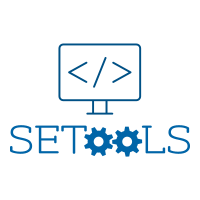

<br />
<p align="center">
  <a href="https://github.com/Theorvolt/SETool">
    
  </a>

  <h3 align="center">SETool</h3>

  <p align="center">
    A cool visualization webapp for Monash University units!
    <br />
    <br />
    <a href="https://github.com/Theorvolt/SETool/issues">Report Bug / Request Feature</a>
  </p>
</p>


# Table of Contents

1. [What is SETools?](#what-is-setools?)
    1. [Technical details](##technical-details)

2. [Running it locally](#getting-started)
    1. [pip requirements](##pip-requirements)
    2. [Running SETools](##run-instructions)

3. [Future plans](#future-plans)

4. [Contributing](#contributing)

5. [License](#license)

6. [Contact](#contact)

7.  [Acknowledgements](#acknowledgements)


# What is SETools?

SETools is a visualization web app that summarizes unit information and gives you details on how a unit was rated by students visually. Check it out here: [https://setool.herokuapp.com/](https://setool.herokuapp.com/). More information is available on the website.

## Technical details

The website is rendered with the use of the Dash library which facilitates data based visualizations natively. All the specific mechanisms are coded in Python with related Dash components.


# Getting Started

If you wish to run this app locally, you may follow the instructions below.

## Pip requirements

See the `requirements.txt` file for more information.

## Running SETools

1. Clone the repository, and in the `webapp_main.py` replace the following:
```py
app.run_server(debug=False, port=int(os.environ.get('PORT', 5000)),host='0.0.0.0')
```
with this:
```py
app.run_server(debug=False, port=5000)
```
Or alternatively a port of your choice. Run the python file and you should be able to visit http://127.0.0.1:PORT (where PORT is the port you chose) and the app should be up.


# Roadmap

Most of the features really just concern web design.

* Dark mode without any add-ons
* Writing javascript callback libraries so the website can be converted to a static site and become hosted on github pages.
* More filters

# Contributing

Simply fork the repository, modify it as you please then submit a pull request which will then be merged.

# License

Distributed under the MIT License. See `LICENSE` for more information.


# Contact

Sai kumar Murali krishnan - [LinkedIn](https://www.linkedin.com/in/sai-kumar-murali-krishnan/) - theorvoltbusiness@gmail.com

Project Link: [https://github.com/Theorvolt/SETool](https://github.com/Theorvolt/SETool)


# Acknowledgements

* Thanks to everyone who helped out with the website design and gave feedback!
